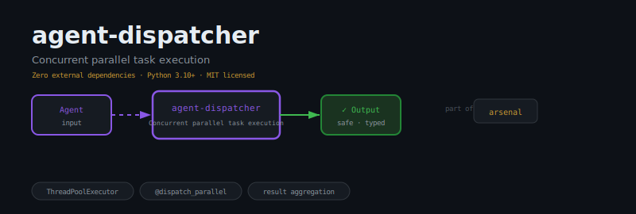
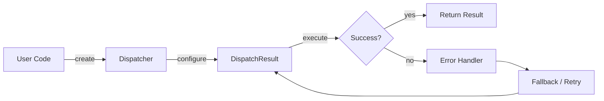
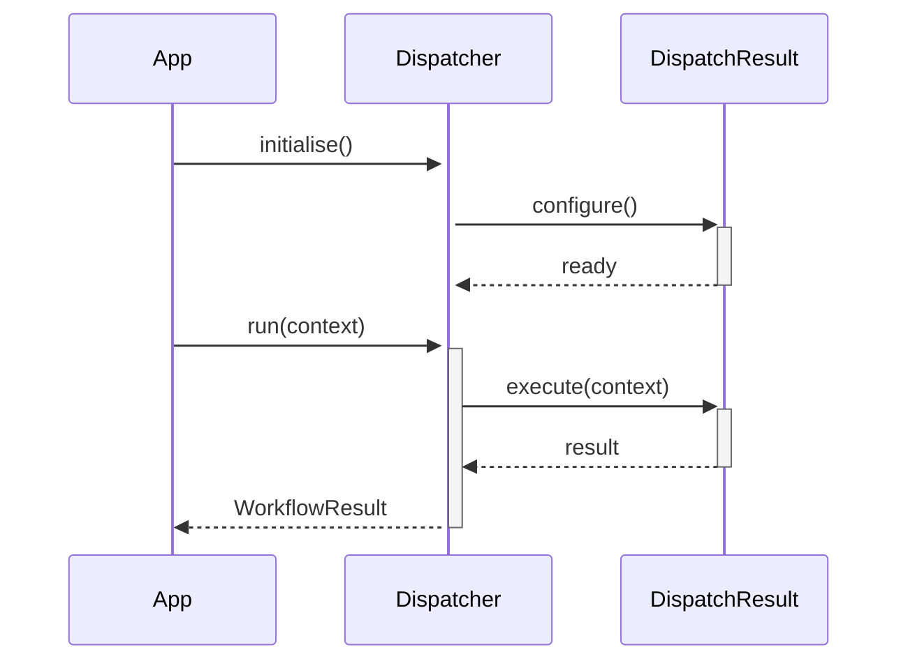

<div align="center">

</div>

# agent-dispatcher

**Concurrent task dispatcher for parallel agent execution**

[](https://pypi.org/project/agent-dispatcher/) [](https://python.org) [](LICENSE) [](#)

---

## The Problem

Without a dispatcher, event handling logic scatters across every handler that checks `if event.type == ...`. Adding a new handler requires modifying existing code; removing one silently breaks others. The fan-out problem compounds with agent complexity.

## Installation

```bash
pip install agent-dispatcher
```

## Quick Start

```python
from agent_dispatcher import Dispatcher, DispatchResult

# Initialise
instance = Dispatcher(name="my_agent")

# Use
result = instance.run()
print(result)
```

## API Reference

### `Dispatcher`

```python
class Dispatcher:
    """
    def __init__(self, max_workers: int = 4, timeout_seconds: float = 30.0) -> None:
    def _get_executor(self) -> ThreadPoolExecutor:
    def _run_task(self, task: Task) -> DispatchResult:
```

### `DispatchResult`

```python
class DispatchResult:
    """Holds the outcome of a dispatched Task."""
    def __init__(
    def to_dict(self) -> dict:
    def __repr__(self) -> str:
```


## How It Works

### Flow



### Sequence



## Philosophy

> *Indra* dispatched messengers across the cosmos; routing is the oldest form of orchestration.

---

*Part of the [arsenal](https://github.com/darshjme/arsenal) — production stack for LLM agents.*

*Built by [Darshankumar Joshi](https://github.com/darshjme), Gujarat, India.*
