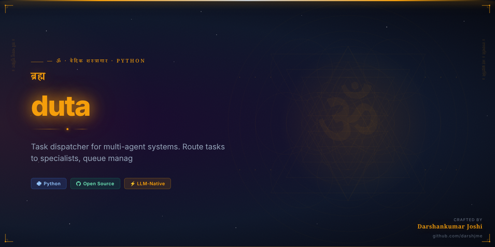
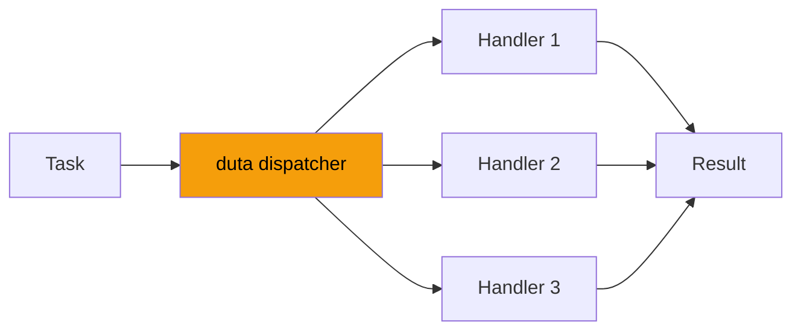

<div align="center">



# ⚡ दूत
## `duta`

> *Ramayana — Hanuman as Duta*

### The Divine Messenger — Hanuman's mission

**Task dispatcher for multi-agent systems. Route tasks to specialists, queue management, priority scheduling.**

[](https://python.org)
[](https://github.com/darshjme/duta)
[](https://github.com/darshjme/arsenal)
[](LICENSE)

*Formerly `agent-dispatcher` — Part of the [**Vedic Arsenal**](https://github.com/darshjme/arsenal): 100 production-grade Python libraries for LLM agents, each named from the Vedas, Puranas, and Mahakavyas.*

</div>

---

## The Vedic Principle

When Ram needed to communicate with Sita across the ocean, across enemy lines, across impossible distances — he sent Hanuman. The perfect *Duta*: swift, intelligent, loyal, capable of carrying complex messages faithfully.

`duta` implements this divine messenger pattern for LLM agents. Tasks are dispatched to the right handler, messages routed to the right processor, with the faithfulness of Hanuman and the intelligence to know which path to take.

Hanuman didn't just carry Ram's ring — he carried Ram's *intention*. `duta` doesn't just route messages — it carries the full context, the full purpose, to exactly where it needs to go.

---

## How It Works



---

## Installation

```bash
pip install duta
```

Or from source:
```bash
git clone https://github.com/darshjme/duta.git
cd duta && pip install -e .
```

## Quick Start

```python
from duta import *

# See examples/ for full usage
```

---

## The Vedic Arsenal

`duta` is one of 100 libraries in **[darshjme/arsenal](https://github.com/darshjme/arsenal)** — each named from sacred Indian literature:

| Sanskrit Name | Source | Technical Function |
|---|---|---|
| `duta` | Ramayana — Hanuman as Duta | The Divine Messenger — Hanuman's mission |

Each library solves one problem. Zero external dependencies. Pure Python 3.8+.

---

## Contributing

1. Fork the repo
2. Create feature branch (`git checkout -b fix/your-fix`)  
3. Add tests — zero dependencies only
4. Open a PR

---

<div align="center">

**⚡ Built by [Darshankumar Joshi](https://github.com/darshjme)** · [@thedarshanjoshi](https://twitter.com/thedarshanjoshi)

*"कर्मण्येवाधिकारस्ते मा फलेषु कदाचन"*
*Your right is to action alone, never to its fruits. — Bhagavad Gita 2.47*

[Vedic Arsenal](https://github.com/darshjme/arsenal) · [GitHub](https://github.com/darshjme) · [Twitter](https://twitter.com/thedarshanjoshi)

</div>
